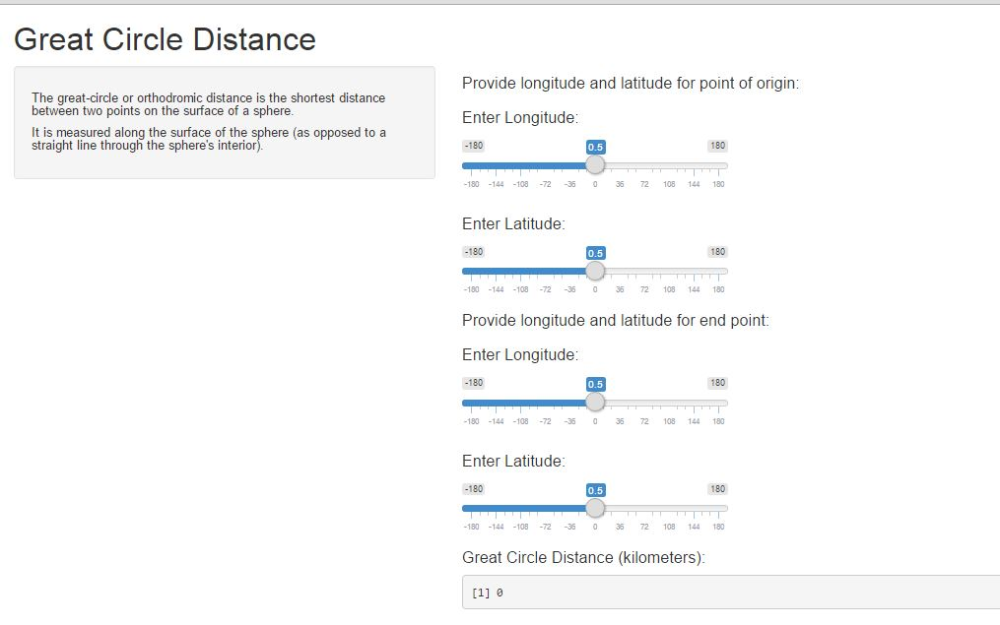

## Introduction
The great-circle or orthodromic distance is the shortest distance between two points on the surface of a sphere, measured along the surface of the sphere (as opposed to a straight line through the sphere's interior). 

The distance between two points in Euclidean space is the length of a straight line between them, but on the sphere there are no straight lines. In non-Euclidean geometry, straight lines are replaced by geodesics. Geodesics on the sphere are the great circles (circles on the sphere whose centers coincide with the center of the sphere).

---  

## Shiny App

An app that calculates shortest distance between two points on the surface of a sphere, measured along the surface of the sphere.





---

## Code

The code that actually calculates the great circle is:


```r
gcd <- function(long1, lat1, long2, lat2) {
  R <- 6371 # Earth mean radius [km]
  d <- acos(sin(lat1)*sin(lat2) + cos(lat1)*cos(lat2) * cos(long2-long1)) * R
  return(d) # Distance in km
}

gcd(12,13,14,15) #test points
```

```
## [1] 6219.856
```

---

## Thank you

The shiny app is avaliable at : https://pratsubedi.shinyapps.io/gcdc/

Please try and like and share!

---
